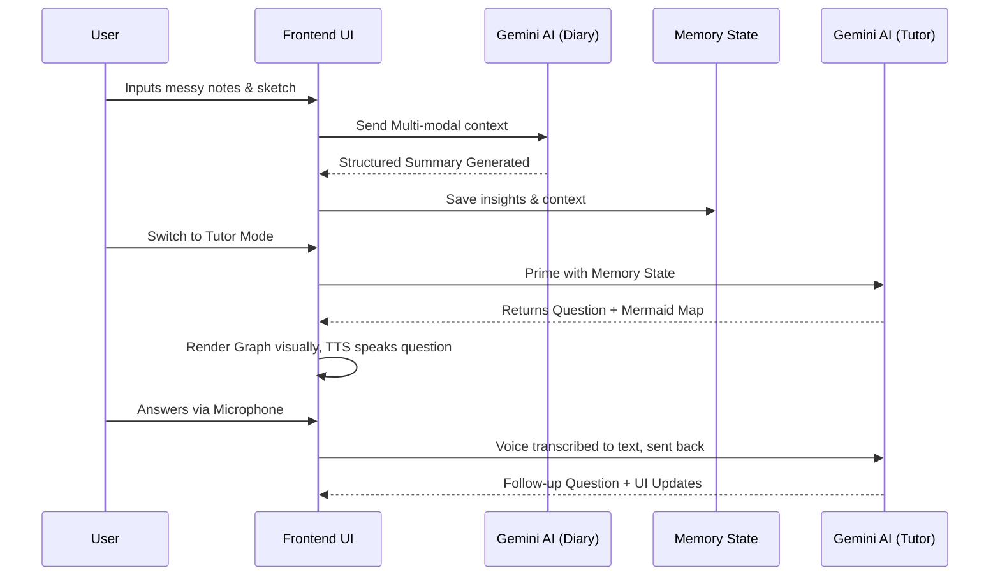

# MindMeld: Data Flow & Architecture Pipeline

This document explains the input, processing, and output pipeline inside MindMeld. It bridges the gap between unstructured user information and highly adaptive graphical tutoring.

## High-Level Pipeline

The system operates over a continuous memory loop divided into three primary phases:

### Phase 1: Passive Input (Diary Mode)
- **Input Types:** Unstructured Text (User notes, thoughts), Images (Screenshots, handwritten diagrams uploaded via file picker).
- **Processing (Client-Side):** `mediaUtils.ts` detects if an image is provided. If so, it gets downscaled through an HTML5 `<canvas>` to ensure efficient bandwidth limits before transmission.
- **AI Processing (Server/Gemini):** A system instructions prompt parses the mixed modalities. It strictly avoids "teaching" at this stage and strictly acts as an organizer. 
- **Output:** A structured markdown string containing summaries and bulleted insights.

### Phase 2: Memory Transfer (State Layer)
- **State Management:** When the user transitions from Diary to Tutor mode, the global React state captures the generated text from Phase 1.
- **Context Priming:** The structured insights act as the "Ground Truth Memory" for the next persona.

### Phase 3: Active Output (Tutor Mode)
- **Input:** The structured memory from Phase 2, mixed with any real-time responses from the user.
- **AI Processing (Server/Gemini):** The Tutor model receives a new system prompt instructing it to ask Socratic questions based on the transferred memory. Crucially, it is also instructed to emit structured code blocks when needed.
- **Dynamic Visual Outputs:**
  1. **Concept Maps:** The AI outputs ````mermaid ... ```` syntax. The UI suppresses this text from the chat log and redirects it to the `mermaid.render()` engine, which paints an interactive SVG dependency graph.
  2. **Generative SVG Illustrations:** If a spatial concept needs explaining, the AI outputs ````xml <svg>...</svg> ````. This is parsed by the application and injected into the canvas area, applying CSS fixes to ensure everything is visible.
- **Dynamic Audio Outputs:** The text response is streamed line-by-line using the browser's native `SpeechSynthesisUtterance` (TTS).
- **User Feedback Loop:** The user answers via Text Input or Live Audio (Speech-to-Text). Their answer is appended to the chat, re-triggering Phase 3's AI Processing logic.

## Diagrammatic Representation

Below is a textual flowchart indicating state changes. *(For a graphical look, please see the `flow-diagram.svg` included in this folder).*


